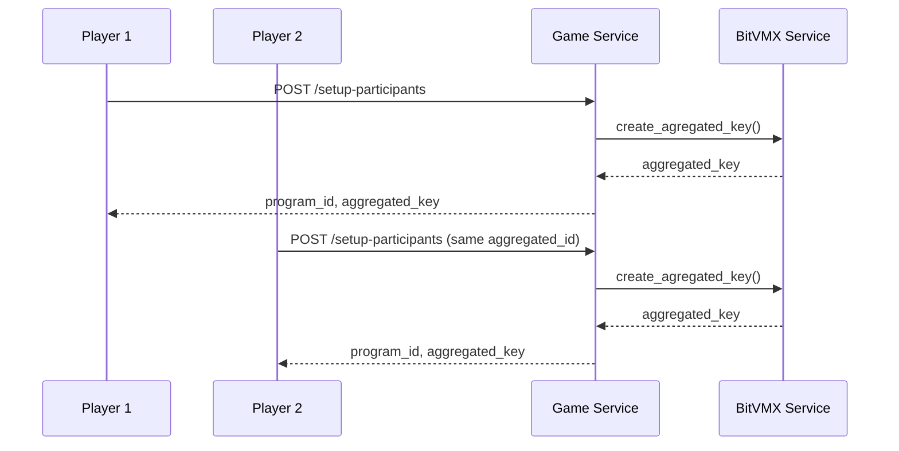
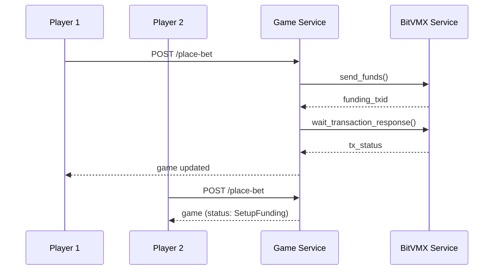
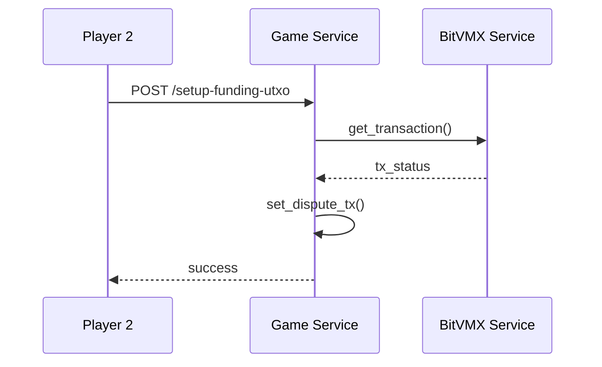
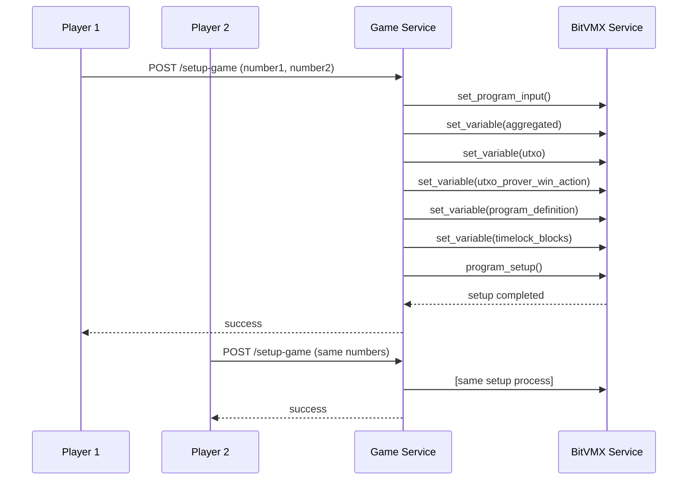
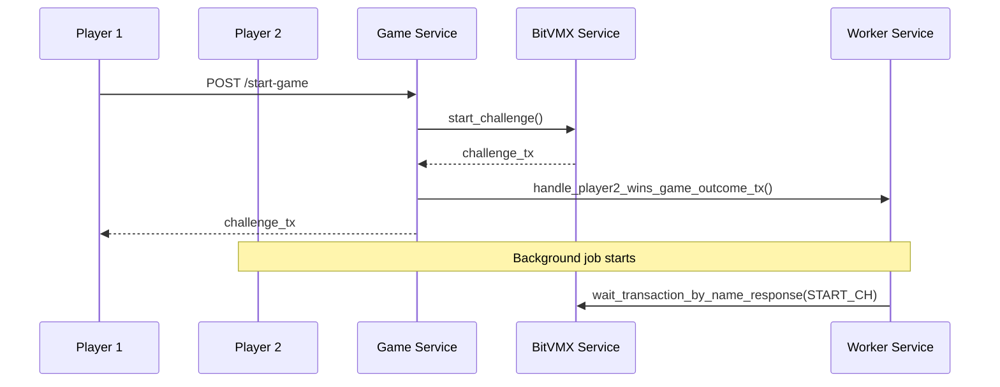
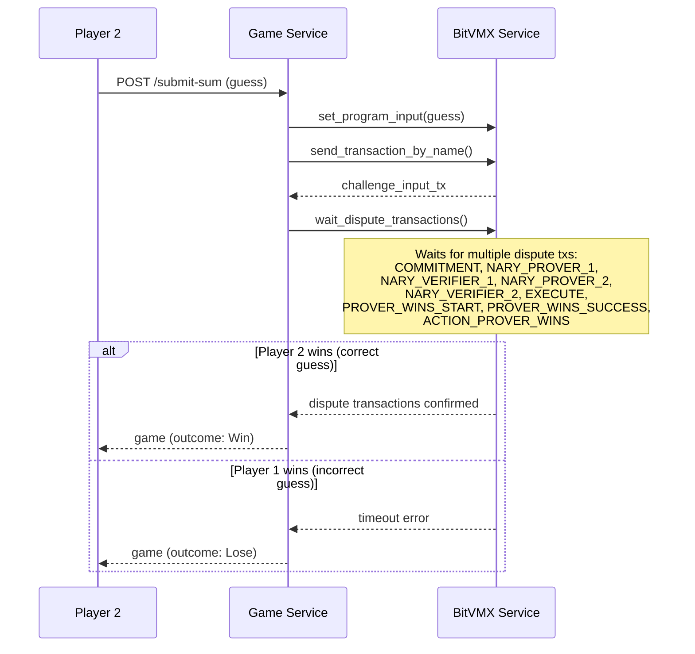

# Add Numbers Game Flow

This document explains the complete flow of the Add Numbers game, a BitVMX-based game where two players compete to solve a mathematical challenge. The game uses Bitcoin's dispute resolution protocol to ensure fair play and automatic fund distribution.

## Game Overview

The Add Numbers game is a two-player game where:

- **Player 1** creates the game and provides two numbers to sum
- **Player 2** joins the game and tries to guess the correct sum
- The game uses BitVMX's dispute resolution protocol to verify the answer
- The winner automatically receives the bet funds

## Game States

The game progresses through the following states:

1. `Setup Participants` - Initialize game participants and create aggregated key
2. `Place Bet` - Players place their bets
3. `Setup Funding` - Set up funding UTXOs for the game
4. `Setup Game` - Configure the game with numbers to sum
5. `Start Game` - Player 1 starts the challenge
6. `Submit Game Data` - Player 2 submits their guess
7. `Game Complete` - Game ends with winner determined
8. `Finished` - Final state

---

## Step-by-Step Game Flow

### Step 1: Setup Participants

**What happens:** Both players initialize the game by creating an aggregated key and sharing participant information.

**Player 1 Actions:**

- Calls `/setup-participants` with their P2P address, public key, and role as Player1
- Receives a `program_id` and `aggregated_key`

**Player 2 Actions:**

- Calls `/setup-participants` with the same `aggregated_id` and their information
- Receives the same `program_id` and `aggregated_key`

**BitVMX Interactions:**

- Creates aggregated key from participant public keys
- Generates program ID from aggregated ID

### Step 2: Place Bet

**What happens:** Players place their bets by sending funds to the aggregated address.

**Player 1 Actions:**

- Calls `/place-bet` with bet amount
- System sends funds to aggregated address (protocol fees + bet amount)
- Waits for transaction confirmation

**Player 2 Actions:**

- Calls `/place-bet` with bet amount
- System automatically transitions to `SetupFunding` state

**BitVMX Interactions:**

- Sends funds to aggregated address
- Waits for transaction confirmation
- Creates funding UTXOs

### Step 3: Setup Funding UTXO

**What happens:** Player 2 provides their funding UTXOs to complete the funding setup.

**Player 2 Actions:**

- Calls `/setup-funding-utxo` with their funding UTXOs
- System validates and stores the UTXOs

**BitVMX Interactions:**

- Validates funding transaction
- Sets up dispute transactions for protocol and bet UTXOs

### Step 4: Setup Game

**What happens:** Both players configure the game with the numbers to sum.

**Both Players Actions:**

- Call `/setup-game` with the two numbers to sum
- System configures the BitVMX program with game parameters

**BitVMX Interactions:**

- Sets program input with concatenated numbers
- Sets aggregated key variable
- Sets protocol and bet UTXOs
- Sets program definition file path
- Sets timelock blocks
- Performs program setup

### Step 5: Start Game

**What happens:** Player 1 initiates the game by sending a challenge transaction.

**Player 1 Actions:**

- Calls `/start-game`
- System sends challenge transaction to start the game
- Enqueues job to wait for game outcome

**Player 2 Actions:**

- System automatically waits for the challenge transaction
- Enqueues job to wait for start game transaction

**BitVMX Interactions:**

- Dispatches START_CH transaction
- Returns challenge transaction status

### Step 6: Submit Sum

**What happens:** Player 2 submits their guess and the dispute resolution process begins.

**Player 2 Actions:**

- Calls `/submit-sum` with their guess
- System sets the guess as program input
- Sends challenge input transaction

**BitVMX Interactions:**

- Sets program input with guess
- Dispatches challenge input transaction
- Waits for dispute transactions to be confirmed
- Determines game outcome based on dispute results

### Step 7: Game Completion

**What happens:** The game concludes with automatic winner determination and fund distribution.

**Both Players:**

- Receive final game state with outcome
- Funds are automatically distributed to the winner through BitVMX protocol

**BitVMX Interactions:**

- Executes dispute resolution protocol
- Automatically transfers funds to winner
- Updates game state to `GameComplete`

---

## Key BitVMX Interactions Summary

Throughout the game, the following BitVMX operations are performed:

1. **Key Management:**
   - `create_agregated_key()` - Creates shared public key
   - `get_pub_key()` - Gets operator public key

2. **Fund Management:**
   - `send_funds()` - Sends funds to aggregated address
   - `wait_transaction_response()` - Waits for transaction confirmation
   - `get_transaction()` - Gets transaction status

3. **Program Configuration:**
   - `set_variable()` - Sets program variables (aggregated key, UTXOs, etc.)
   - `set_program_input()` - Sets input data (numbers, guess)
   - `program_setup()` - Initializes the BitVMX program

4. **Transaction Management:**
   - `start_challenge()` - Dispatches challenge transaction
   - `send_transaction_by_name()` - Sends specific transactions
   - `wait_transaction_by_name_response()` - Waits for specific transactions

5. **Dispute Resolution:**
   - Waits for multiple dispute transactions to determine game outcome
   - Automatically executes fund transfers based on dispute results

## Game Outcome Logic

- **Player 2 Wins:** If Player 2's guess is correct, all dispute transactions are confirmed, and Player 2 receives the bet funds
- **Player 1 Wins:** If Player 2's guess is incorrect, the dispute process times out, and Player 1 receives the bet funds

The game ensures fairness through BitVMX's cryptographic dispute resolution protocol, making it impossible for either player to cheat.
