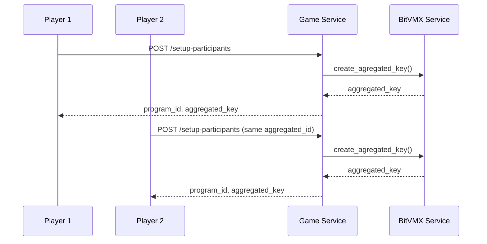
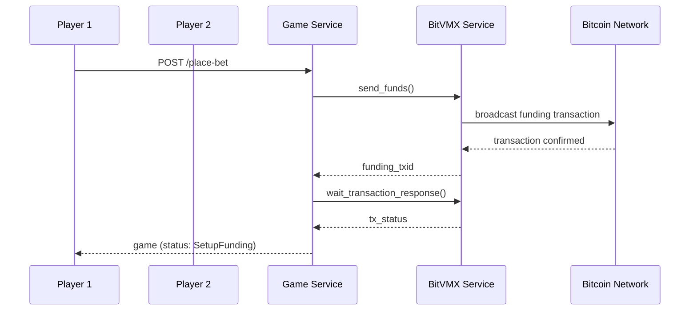
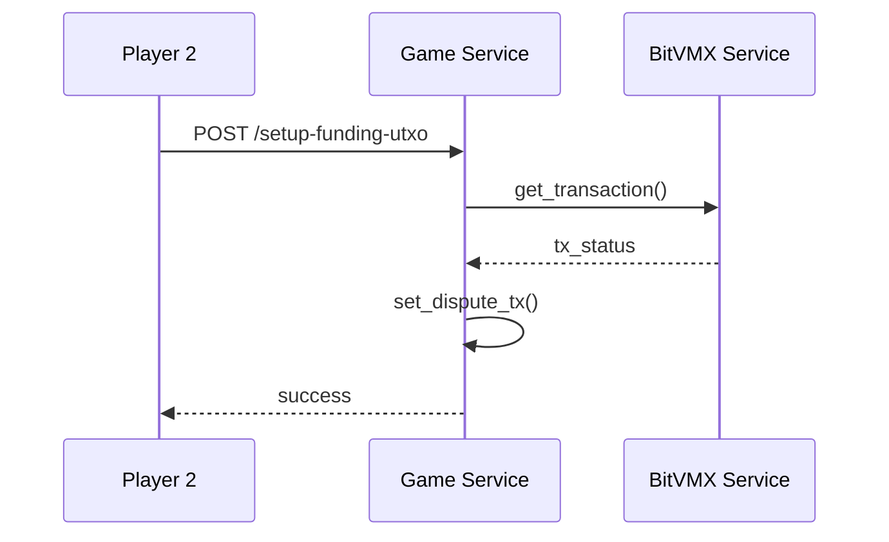
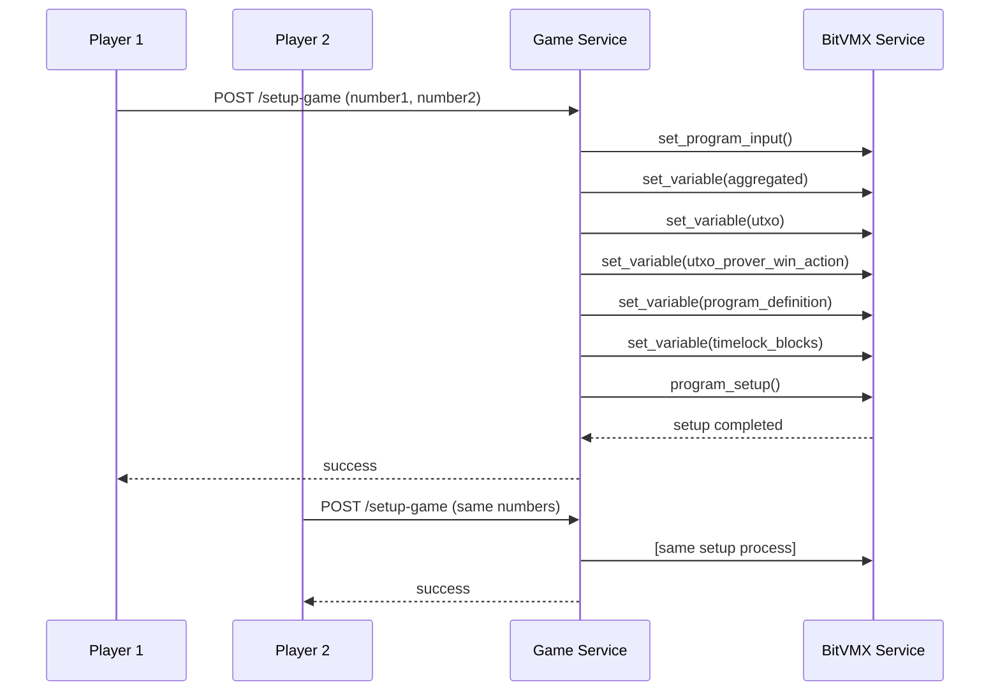
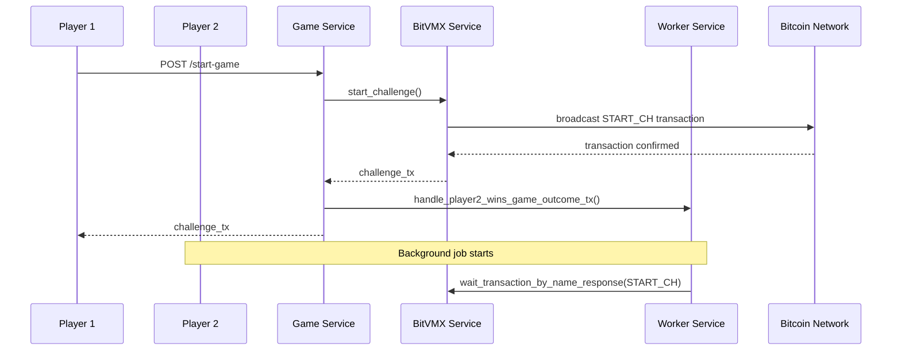
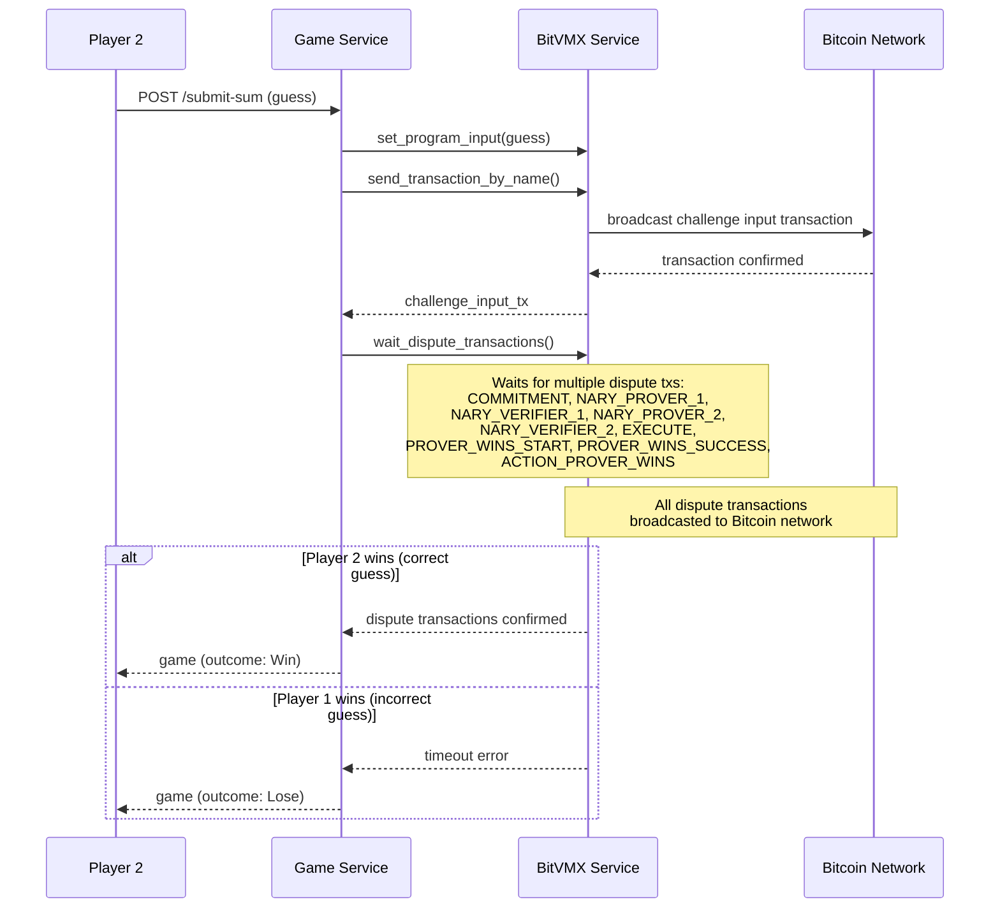
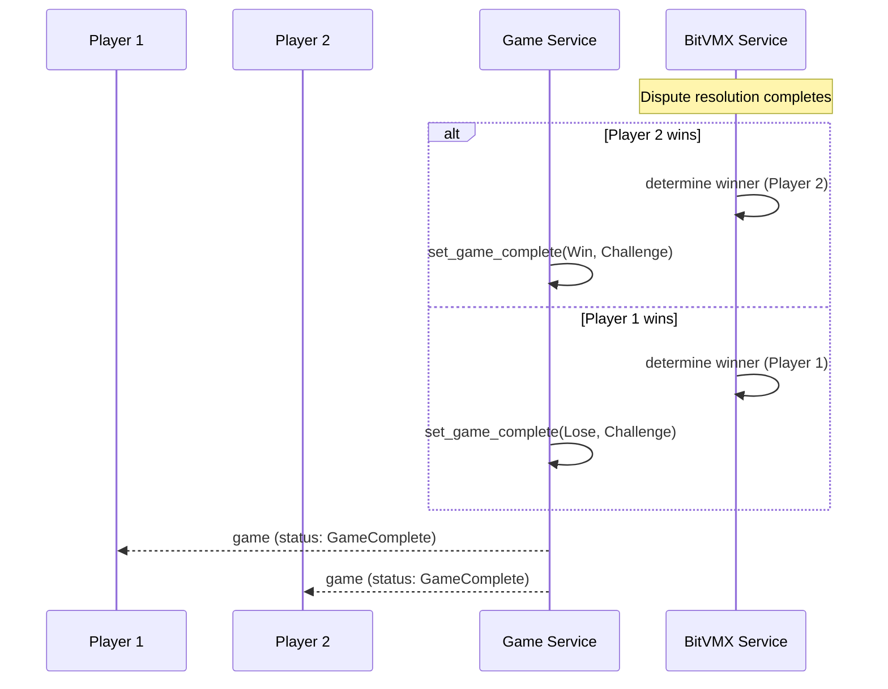

# Add Numbers Game Flow

This document explains the complete flow of the Add Numbers game, a BitVMX-based game where two players compete to solve a mathematical challenge. The game uses Bitcoin's dispute resolution protocol to ensure fair play and automatic fund distribution.

## Game Overview

The Add Numbers game is a two-player game where:

- **Player 1** creates the game and provides two numbers to sum
- **Player 2** joins the game and tries to guess the correct sum
- The game uses BitVMX's dispute resolution protocol to verify the answer
- The winner automatically receives the bet funds

## BitVMX One-Time Setup

Before any game can be played, both players must perform a one-time initialization process on their respective BitVMX nodes. This setup creates the necessary cryptographic keys, establishes P2P communication, and funds the system for Bitcoin operations.

The `initial_setup()` method performs the following initialization steps:

1. **P2P Address Setup** - Establishes peer-to-peer communication information for BitVMX protocol participation
2. **Wallet Address Setup** - Creates and funds the main Bitcoin wallet (requires at least 1 BTC)
3. **Operator Key Creation** - Generates the main cryptographic key for protocol operations
4. **Funding Key Creation** - Sets up Child Pays for Parent (CPFP) speed-up capability (requires 1 BTC)

This one-time setup is essential for any BitVMX node to participate in protocols, handle Bitcoin transactions, and perform speed-up operations when needed. The setup must be completed before any game can be initiated.

## Game States

The game progresses through the following states:

1. `Setup Participants` - Initialize game participants and create aggregated key
2. `Place Bet` - Players place their bets
3. `Setup Funding` - Set up funding UTXOs for the game
4. `Setup Game` - Configure the game with numbers to sum
5. `Start Game` - Player 1 starts the challenge
6. `Submit Game Data` - Player 2 submits their guess
7. `Game Complete` - Game ends with winner determined
8. `Finished` - Final state

---

## Step-by-Step Game Flow

### Step 1: Setup Participants

**What happens:** Both players first share their participant information, then each player submits all participants' information to create the aggregated key. If participant information differs between players, the aggregated key creation will fail.

**Player 1 Actions:**

- Copies Player 2's information and adds their own P2P address, public key, and role as Player1
- Calls `/setup-participants` with complete participant information (both players)
- Receives a `program_id` and `aggregated_key`

**Player 2 Actions:**

- Copies Player 1's information and adds their own P2P address, public key, and role as Player2
- Calls `/setup-participants` with the same `aggregated_id` and complete participant information (both players)
- Receives the same `program_id` and `aggregated_key`

**BitVMX Interactions:**

- Creates aggregated key from participant public keys
- Validates that participant information matches between players
- Generates program ID from aggregated ID

### Step 2: Place Bet

**What happens:** Player 1 places their bet by sending funds to the aggregated address.

**Player 1 Actions:**

- Calls `/place-bet` with bet amount
- System sends funds to aggregated address (protocol fees + bet amount)
- Waits for transaction confirmation
- System automatically transitions to `SetupFunding` state

**Player 2 Actions:**

- No action required - waits for Player 1 to place bet

**Bitcoin Interactions:**

- Sends funds to aggregated address
- Waits for transaction confirmation
- Creates funding UTXOs

### Step 3: Setup Funding UTXO

**What happens:** Player 2 waits for Player 1 to share the bet UTXOs and stores them for later use in the setup game step.

**Player 2 Actions:**

- Calls `/setup-funding-utxo` to receive and store Player 1's bet UTXOs
- System validates and stores the UTXOs for use in game setup

**Player 1 Actions:**

- No action required - bet UTXOs already known from place-bet step

**BitVMX Interactions:**

- Validates funding transaction
- Sets up dispute transactions for protocol and bet UTXOs

### Step 4: Setup Game

**What happens:** Both players configure the game with the numbers to sum. Both players must set up the same numbers, otherwise the game creation will fail. This ensures that all participants agree on the same inputs for the BitVMX program, as the game is implemented as a program in BitVMX.

**Both Players Actions:**

- Call `/setup-game` with the two numbers to sum
- Must use the same numbers as the other player
- System configures the BitVMX program with game parameters

**BitVMX Interactions:**

- Sets program input with concatenated numbers
- Sets aggregated key variable
- Sets protocol and bet UTXOs
- Sets program definition file path
- Sets timelock blocks
- Performs program setup

### Step 5: Start Game

**What happens:** Player 1 initiates the game by sending a challenge transaction. START_CH (Start Challenge) begins the dispute process. From this point on, Player 1 becomes the Verifier and Player 2 becomes the Prover.

**Player 1 Actions (Verifier):**

- Calls `/start-game`
- System sends challenge transaction to start the game
- Enqueues job to wait for game outcome

**Player 2 Actions (Prover):**

- System automatically waits for the challenge transaction
- Enqueues job to wait for start game transaction

**BitVMX Interactions:**

- Dispatches START_CH (Start Challenge) transaction
- Initiates the dispute resolution process
- Returns challenge transaction status

**Bitcoin Interactions:**

- Start Challenge transaction is broadcasted to the Bitcoin network

### Step 6: Submit Sum

**What happens:** Player 2 submits their guess and the dispute resolution process begins.

**Player 2 Actions:**

- Calls `/submit-sum` with their guess
- System sets the guess as program input
- Sends challenge input transaction

**BitVMX Interactions:**

- Sets program input with guess
- Dispatches challenge input transaction
- Waits for dispute transactions to be confirmed:
  - COMMITMENT
  - NARY_PROVER_1
  - NARY_VERIFIER_1
  - NARY_PROVER_2
  - NARY_VERIFIER_2
  - EXECUTE
  - PROVER_WINS_START
  - PROVER_WINS_SUCCESS
  - ACTION_PROVER_WINS
- Determines game outcome based on dispute results

**Bitcoin Interactions:**

- Challenge input transaction is broadcasted to the Bitcoin network
- All dispute transactions (COMMITMENT, NARY_PROVER_1, NARY_VERIFIER_1, NARY_PROVER_2, NARY_VERIFIER_2, EXECUTE, PROVER_WINS_START, PROVER_WINS_SUCCESS, ACTION_PROVER_WINS) are broadcasted to the Bitcoin network

### Step 7: Game Completion

**What happens:** The game concludes with automatic winner determination.

**Both Players:**

- Receive final game state with outcome

**BitVMX Interactions:**

- Executes dispute resolution protocol
- Determines winner based on dispute results
- Updates game state to `GameComplete`

---

## Key BitVMX Interactions Summary

Throughout the game, the following BitVMX messages are sent:

1. **Key Management:**
   - `SetupKey` - Creates shared public key from participant information
   - `GetPubKey` - Gets operator public key
   - `GetAggregatedPubkey` - Retrieves aggregated public key

2. **Fund Management:**
   - `SendFunds` - Sends funds to aggregated address
   - `GetFundingAddress` - Gets funding address
   - `GetFundingBalance` - Gets funding balance
   - `GetTransaction` - Gets transaction status

3. **Program Configuration:**
   - `SetVar` - Sets program variables (aggregated key, UTXOs, etc.)
   - `Setup` - Initializes the BitVMX program with participants
   - `SetFundingUtxo` - Sets funding UTXO for speed-up transactions

4. **Transaction Management:**
   - `DispatchTransactionName` - Dispatches specific transactions (START_CH, challenge input, etc.)

5. **P2P Communication:**
   - `GetCommInfo` - Gets P2P communication information

6. **Dispute Resolution:**
   - Waits for multiple dispute transactions to determine game outcome
   - Determines winner based on dispute results

## Game Outcome Logic

- **Player 2 Wins:** If Player 2's guess is correct, all dispute transactions are confirmed, and Player 2 is determined as the winner
- **Player 1 Wins:** If Player 2's guess is incorrect, the dispute process times out, and Player 1 is determined as the winner

The game ensures fairness through BitVMX's cryptographic dispute resolution protocol, making it impossible for either player to cheat.
