# Add Numbers Game Play

This document explains the complete flow of the Add Numbers game, a BitVMX-based game where two players compete to solve a mathematical challenge. The game uses BitVMX's dispute resolution protocol to ensure fair play and the Bitcoin network for decentralized immutable transactions.

## Players

Player 1 will be using the front end at <http://localhost:3000>, and player 2 will be using <http://localhost:3001>

## Game Play Steps

### Step 1: Select the Add Numbers Game

The player should select the game to play. This project only has the Add Numbers game for the moment, but we could add more games later on.

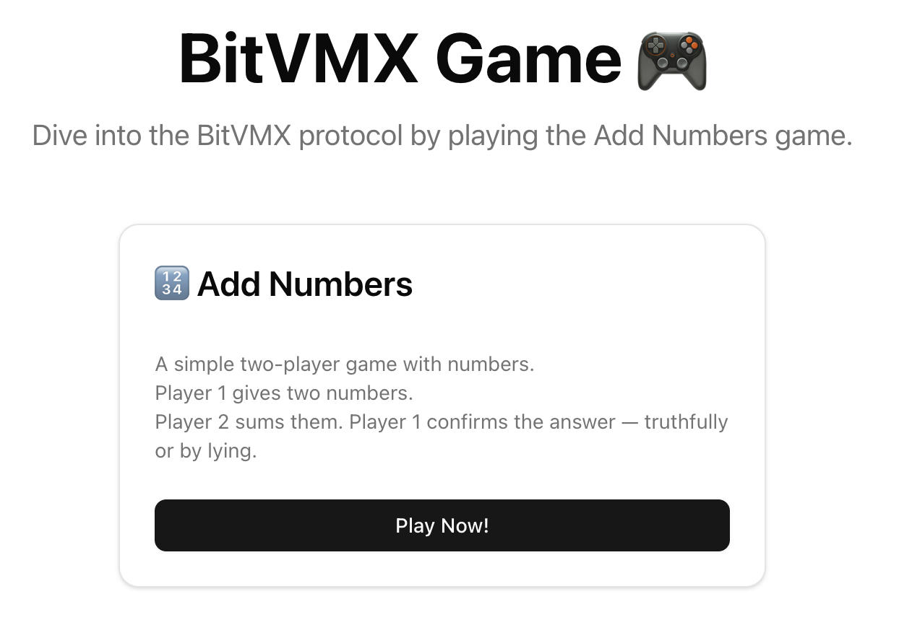

### Step 2: Select the Network

The player selects the Bitcoin network. This game is meant to be used in regtest only for the moment.

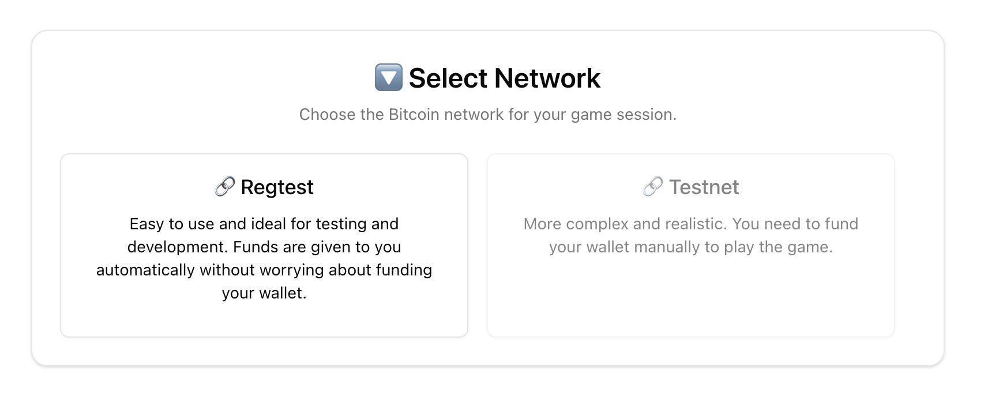

### Step 3: Select Player

Each frontend instance can only select their assigned player. localhost:3000 can only select Player 1, and localhost:3001 can only select Player 2.

**Player 1 Selection (localhost:3000):**
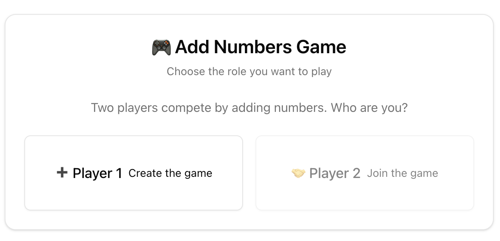

**Player 2 Selection (localhost:3001):**
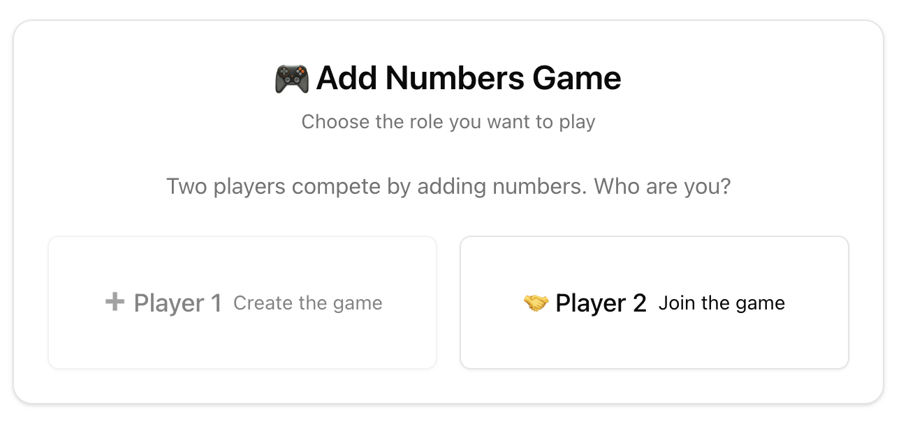

### Step 4: Player Wallets

Each player will see their own wallet view with different Bitcoin addresses and current balance. When setting up the project, each player was given 100 BTC. From this initial balance, 1 BTC was sent to BitVMX for speed up fundings to be used as "child pays for parent" transactions.

**Player 1 Wallet View:**
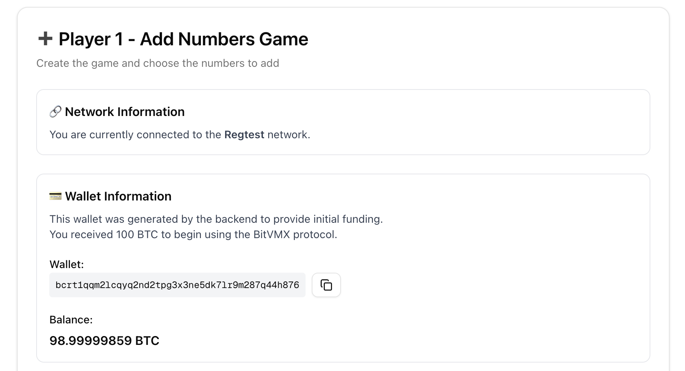

**Player 2 Wallet View:**
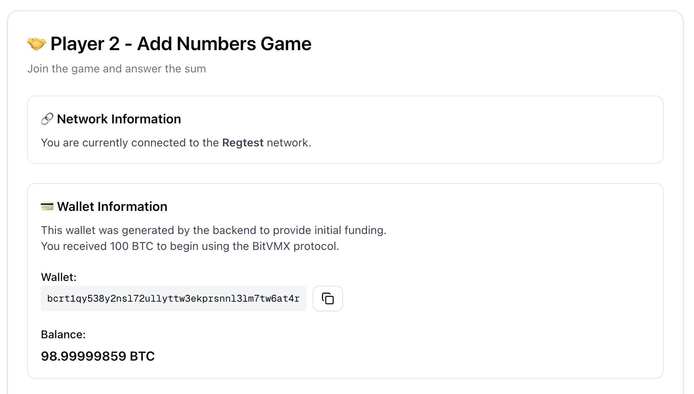

### Step 5: Participant Data Exchange

Before starting the game, players need to exchange participant data. Copy the data from Player 1 at localhost:3000 and paste it into Player 2 at localhost:3001, then copy the data from Player 2 and paste it into Player 1. After exchanging the data and clicking on "Setup Data", the aggregated key using MuSig2 is created.

**Copy Participant Data from Player 1:**
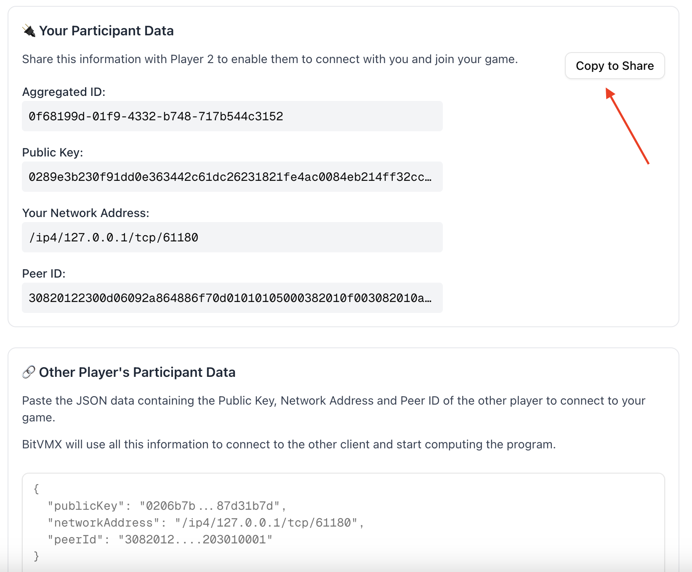

**Paste Participant Data to Player 2:**
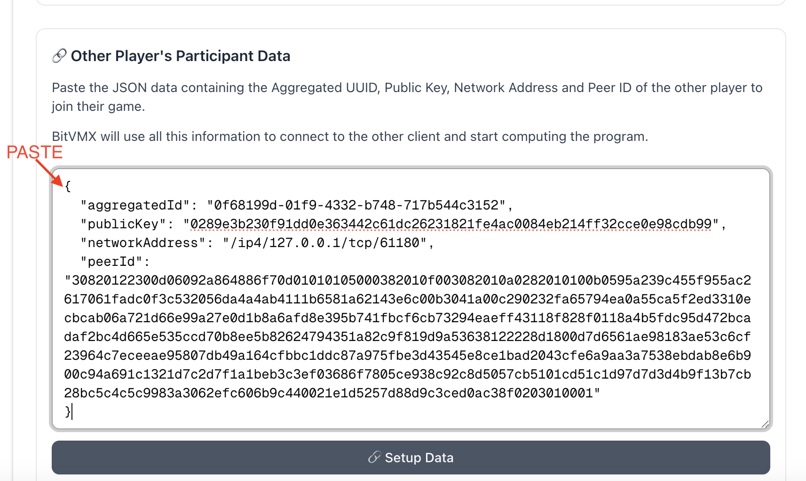

### Step 6: Player 1 Send Bet Transaction

Player 1 transfers 2 UTXOs to the aggregated key. The first UTXO is to pay for protocol fees, and the second UTXO is the bet.

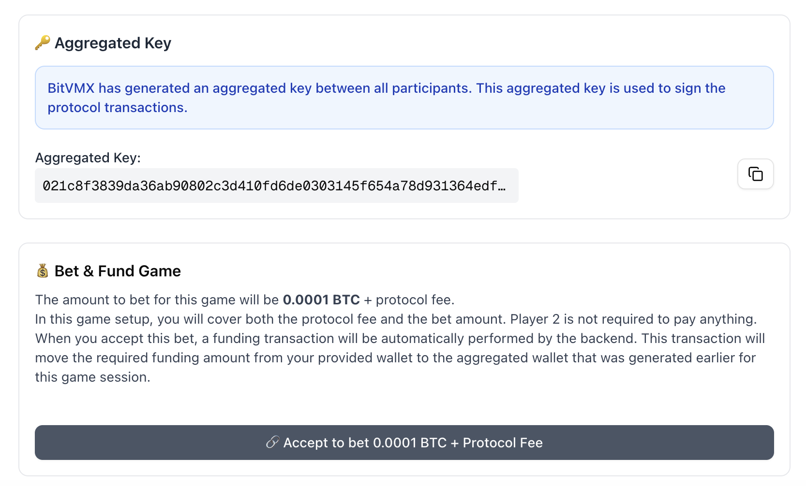

### Step 7: Set Funding UTXO

The UTXOs obtained from step 6 need to be copied from Player 1 and given to Player 2, as both players need to feed the same information when setting up the program. Player 1 already has the UTXOs as it's the one that sent them.

**Copy UTXOs from Player 1:**
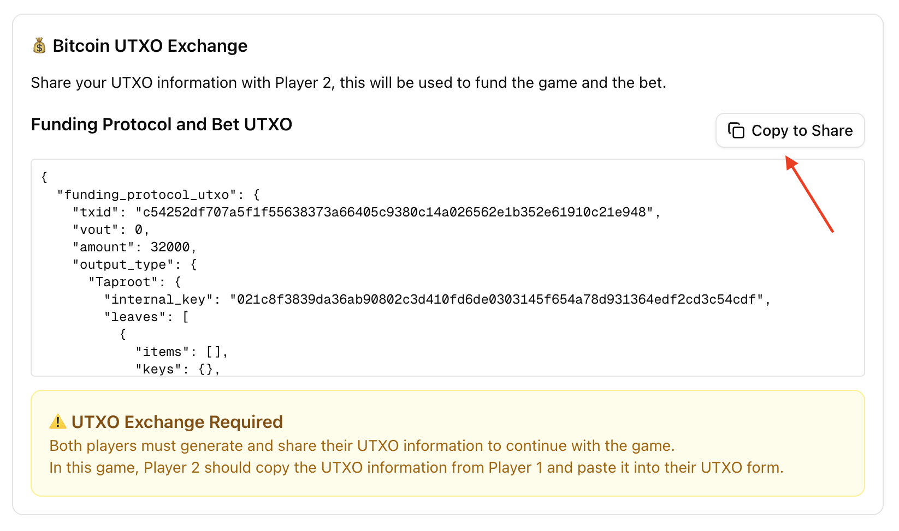

**Paste UTXOs to Player 2:**
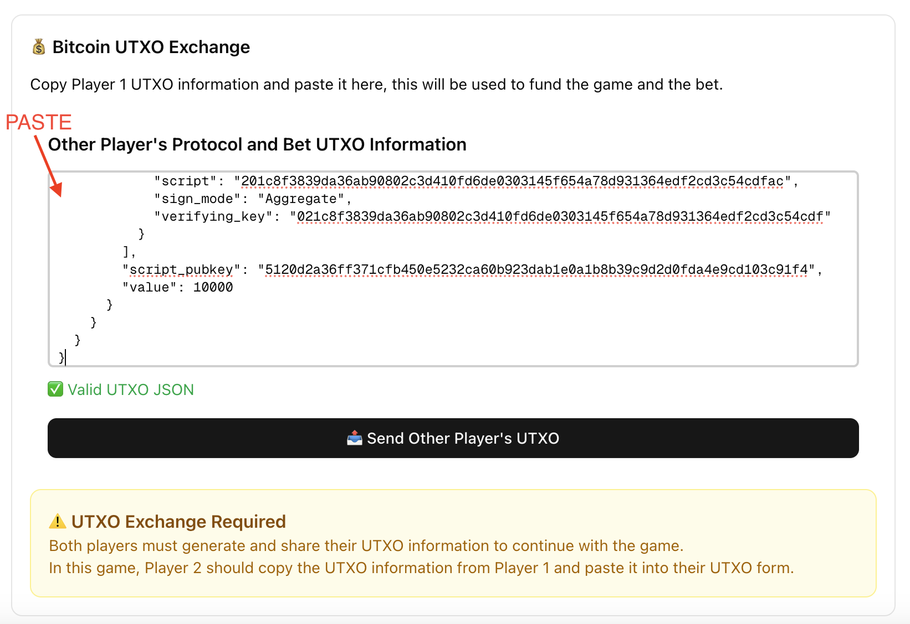

### Step 8: Game Setup

Both players need to enter the exact same numbers and click on "Generate Program". Otherwise, the program won't complete as the other participant won't sign it because they have different values.

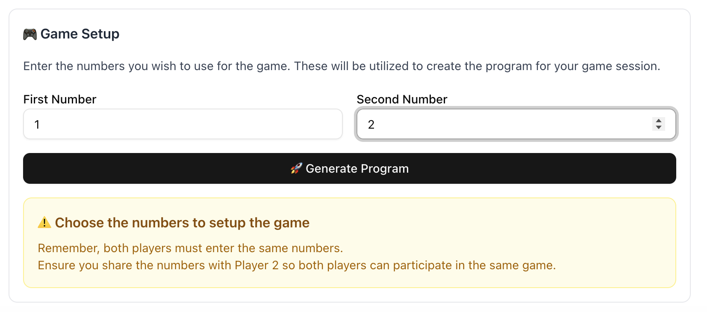

### Step 9: Start Game

Once the game is set up, Player 1 will click on "Start Game" to start the BitVMX dispute protocol, where Player 2 is the prover that needs to show the result of the program. This is done by BitVMX with a start challenge transaction broadcasted to the Bitcoin network. In the meantime, Player 2 is waiting for Player 1 to start the game by watching for the challenge broadcasted transaction.

**Ready to Start Game:**
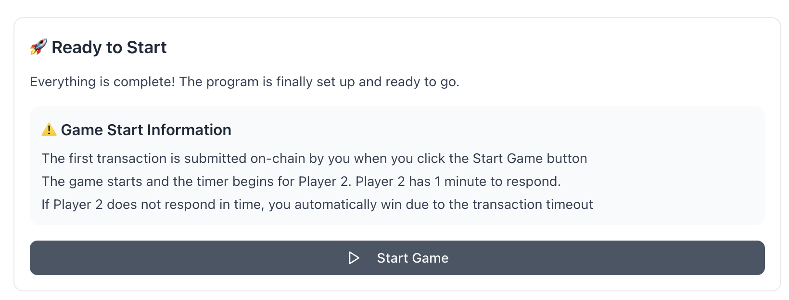

**Player 2 Waiting for Player 1 to Start Game:**
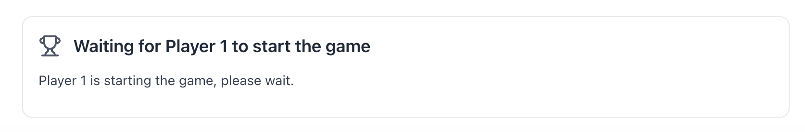

### Step 10: Player 2 Submit Answer

Player 2 needs to enter the answer to the sum of the numbers entered in the setup program. This will be added as an input to the BitVMX program that will continue with the dispute protocol automatically. It takes several transactions to reach the result of the dispute. As this project auto mines blocks every 5 seconds, the dispute resolution takes about a minute.

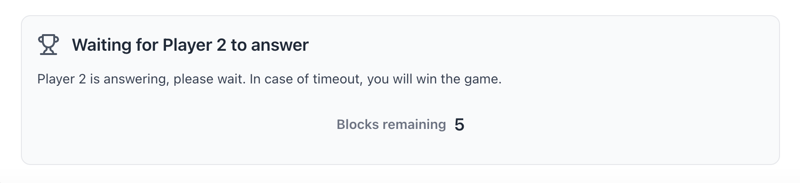

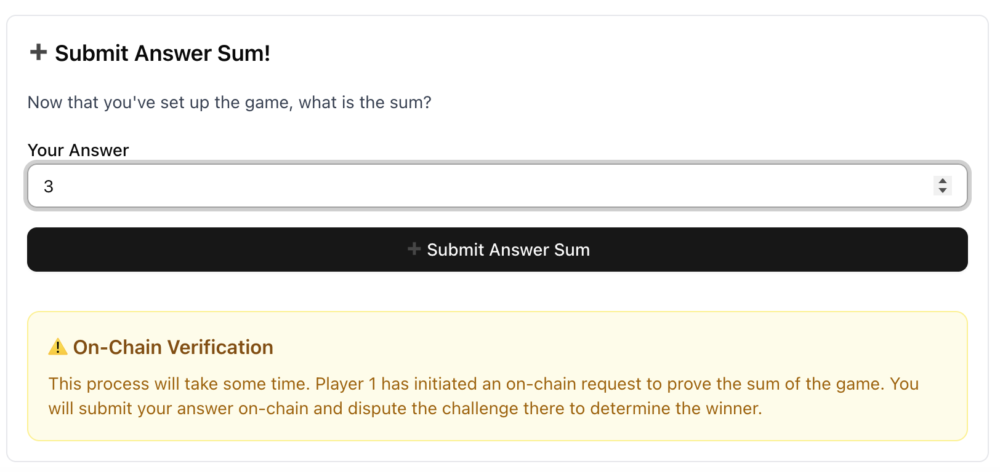

### Step 11: Game Result

BitVMX automatically executed the dispute protocol reaching a winner. If the sum entered is correct, then the winner is Player 2 and Player 1 loses.

**Player 2 Wins:**
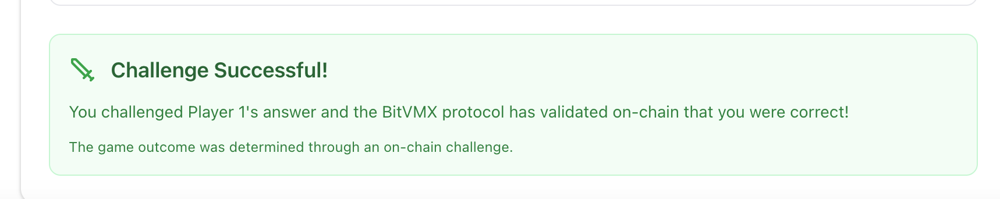

**Player 1 Loses:**
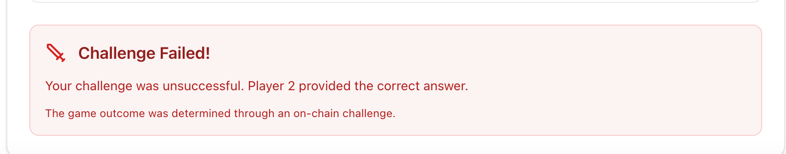

