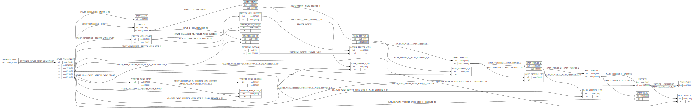

# Add Numbers Game Protocol and Program

This document explains the program and protocol used for the Add Numbers game, a BitVMX-based game where two players compete to solve a mathematical challenge.

## Dispute Resolution Protocol (DRP)

The game uses BitVMX's dispute resolution protocol to ensure fair play and the Bitcoin network for decentralized immutable transactions.

The dispute resolution protocol is a `Directed Acyclic Graphs` (DAGs) of bitcoin transactions between a prover (player 2) and a verifier (player 1) to determine if the execution of a program using [BitVMX-CPU](https://github.com/FairgateLabs/BitVMX-CPU) is correct or not, in a decentralized way with on chain commitments.
You can build your own protocols in BitVMX, to build the necessary `DAG` youn can use the [BitVMX Protocol Builder](https://github.com/FairgateLabs/rust-bitvmx-protocol-builder)  

Participants need to set up a protocol  before using it, they need to:

- Create a musig2 multi signature address, we will call it `agregated key` from now on.
- Fund the agregated key with an a `external start utxo`, this funds will be used to pay for the bitcoin transaction fees needed to broadcast the DAGs transactions on chain in case of a challenge.
- Define an `external action utxo` that will be locked in the agregated key and released when the challenge finishes.
- Sign the DAG's Bitcoin Transactions off-chain.

First the verifier `starts the challenge`, when he thinks the other party obtained an incorrect answer.
Then prover presents the parameter `inputs` used to run the program.
After that an N-ary search is run automatically by bitvmx, where the prover and verifier need to present the values of the search at each iteration to find the discrepancy between the execution traces.
Once it's found, or if a participant don't present the proof before the timeout, the protocol declares a winer.

### DRP Flow Diagram

The following diagram shows the complete DRP protocol flow with all the transactions and their relationships:



## Program

The program being used by add numbers game is `add-test.elf`. The .elf is obtained through compilation of c++ or rust program with RISC V emulator.

### Code

The code of the program is:

```cpp
#include <stdint.h>
#include "emulator.h"

int main(int x)
{
    unsigned int *a = (unsigned *)INPUT_ADDRESS;
    unsigned *b = a + 1;
    unsigned *c = a + 2;
    if (*a + *b == *c)
    {
        return 0;
    }
    else
    {
        return 1;
    }
}
```

### Yaml

Itn order to use it in BitVMX-CPU it needs more information than just the .elf, that's why we pass down a yaml file with the information needed. Like the number of equal parts to dive the array for the N-ary search algorithm, mas number steps to perform and the inputs size and owner.

This is the yaml used for this project:

```yaml
elf: add-test.elf
nary_search: 8
max_steps: 50
input_section_name: .input
inputs:
- size: 8
    owner: const
- size: 4
    owner: prover
```

### Where is this set?

We define the .yaml program path when we send the `IncomingBitVMXApiMessages::Setup` message to BitVMX client, we also set the program type to indicate the protocol we are going to use, in this case we will use the dispute resolution protocol (DRP).

```rust
let program_id = Uuid::new_v4();
let program_path = "./verifiers/add-test-with-const-pre.yaml";
let participants =  vec![p2p_address_1, p2p_address_2];
let leader_idx = 0;

let response = self
    .rpc_client
    .send_request(IncomingBitVMXApiMessages::Setup(
        program_id,
        bitvmx_client::types::PROGRAM_TYPE_DRP,
        participants,
        leader_idx,
    ))
    .await?;
```
