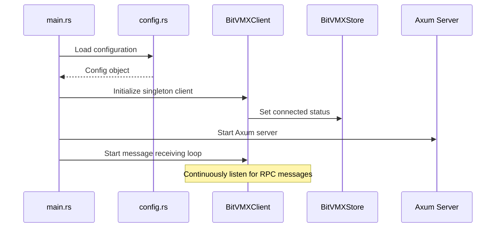
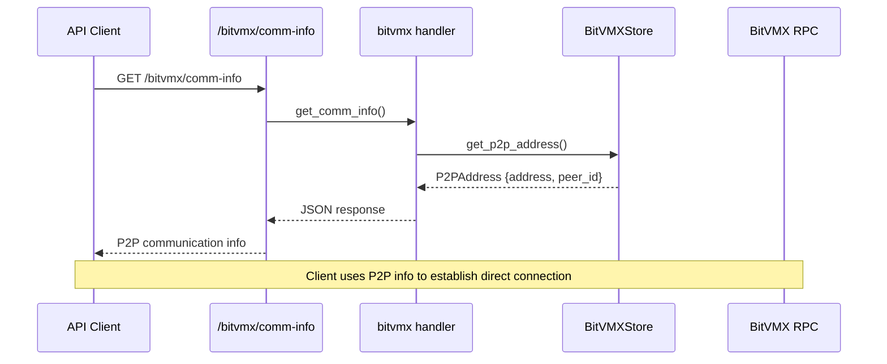
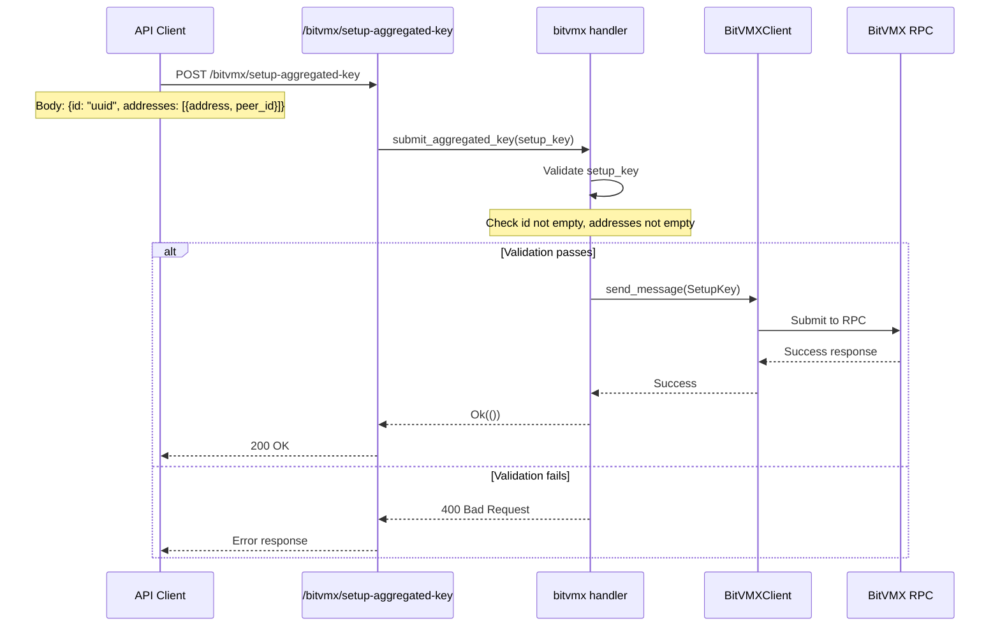
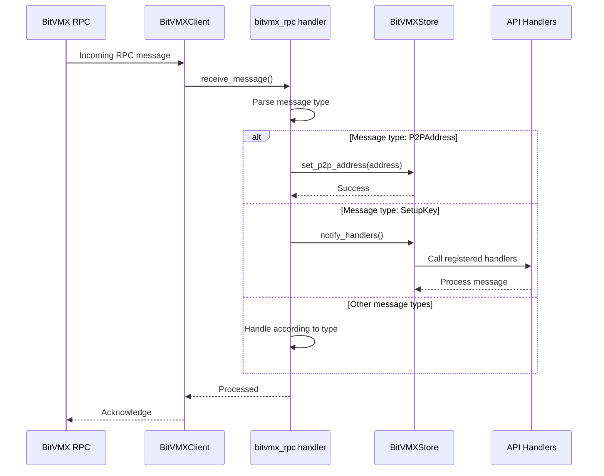

# BitVMX Tic-Tac-Toe Backend

A Rust-based backend service for the BitVMX Tic-Tac-Toe game, built with Axum web framework and integrated with BitVMX RPC for peer-to-peer communication.

## Architecture Overview

The backend is structured as a modular Axum application with the following key components:

- **Routes**: API endpoint definitions with OpenAPI documentation
- **Handlers**: Business logic for processing requests
- **Stores**: Thread-safe shared state management
- **Types**: Data structures with TypeScript bindings
- **BitVMX Integration**: RPC client for peer-to-peer communication

## BitVMX Integration Flow

The BitVMX integration enables peer-to-peer communication between game participants. Here's the detailed flow:

### 1. Application Startup



### 2. P2P Communication Setup



### 3. Aggregated Key Submission



### 4. RPC Message Handling




## Configuration

Configuration is managed through YAML files in the `configs/` directory:

```yaml
# configs/player_1.yaml
bitvmx:
  broker_port: 8080
  l2_id: "player_1"
```

### Environment Variables

The following environment variables can be used to configure the application:

| Variable | Description | Default | Example |
|----------|-------------|---------|---------|
| `CONFIG_FILE` | Configuration file name (without .yaml extension) | `player_1` | `CONFIG_FILE=player_2` |
| `RUST_LOG` | Logging level (debug, info, warn, error) | `info` | `RUST_LOG=debug` |
| `APP_SERVER__HOST` | Server host address | `0.0.0.0` | `APP_SERVER__HOST=127.0.0.1` |
| `APP_SERVER__PORT` | Server port number | `8080` | `APP_SERVER__PORT=3000` |
| `APP_CORS__ALLOWED_ORIGINS` | Comma-separated list of allowed origins | `*` | `APP_CORS__ALLOWED_ORIGINS=http://localhost:3000,https://example.com` |

### Available Configuration Files

The application comes with two pre-configured files in the `configs/` directory:

- `player_1.yaml` - Default configuration for player 1
- `player_2.yaml` - Configuration for player 2

### Running with Custom Configuration

```bash
# Use a different configuration file
CONFIG_FILE=player_2 cargo run
```

## Testing

The application includes comprehensive testing:

- **Unit Tests**: Individual component testing
- **Integration Tests**: End-to-end API testing
- **TypeScript Bindings**: Generated from Rust types for frontend integration

### Running Tests
```bash
cargo test                    # Run all tests
cargo test --test bitvmx     # Run BitVMX integration tests
```

## Development

### Prerequisites
- Rust 1.70+
- Cargo
- BitVMX RPC server running

### Building
```bash
cargo build
cargo build --release
```

### Running
```bash
cargo run
```

### TypeScript Bindings Generation
```bash
cargo test --lib  # Generates bindings during test compilation
```

## API Documentation

The application automatically generates OpenAPI/Swagger documentation using Utoipa. Access the documentation at:

- **Swagger UI**: `http://localhost:3000/swagger-ui/`
- **OpenAPI JSON**: `http://localhost:3000/api-docs/openapi.json`

## Message Flow Summary

1. **Startup**: Application initializes BitVMX client and starts message receiving loop
2. **P2P Setup**: Clients retrieve P2P addresses via `/bitvmx/comm-info`
3. **Key Submission**: Clients submit aggregated keys via `/bitvmx/setup-aggregated-key`
4. **RPC Communication**: Continuous message exchange with BitVMX RPC
5. **State Management**: Centralized store maintains connection state and P2P information

This architecture provides a robust, scalable foundation for peer-to-peer game communication while maintaining clean separation of concerns and comprehensive error handling.
